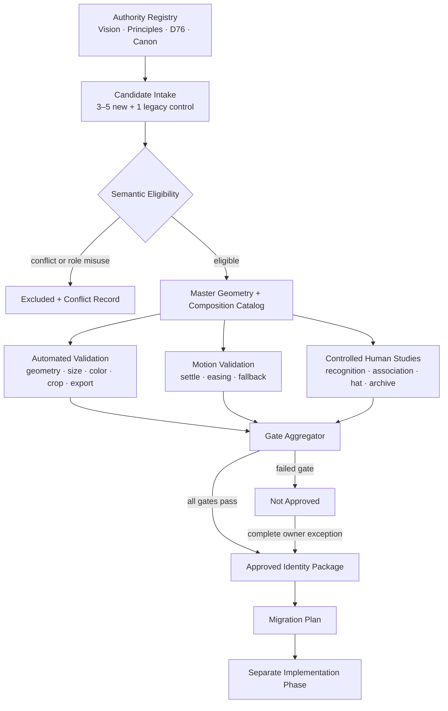

# Ember Logo System — Technical Design

## Overview

The Ember Logo System is a governed identity-production and acceptance system, not a single illustration. It defines how candidate marks are proposed, normalized into a coherent family, tested, selected, exported, documented, and eventually migrated without allowing visual preference or implementation convenience to override product meaning.

The design preserves the hierarchy of truth in this order: Product Vision and Product Principles govern identity meaning; information architecture and mechanics supply established concepts such as Crew, season, rivalry, and earned outcomes; D76 governs current visual semantics; UI composition rules express those decisions; implementation only reproduces approved artifacts. A lower layer may report a conflict but may not resolve it silently.

D76 is treated as a semantic contract. Charcoal is the stable ground, slate denotes stable or cooling states, amber-to-ember denotes live heat and momentum, and champagne gold denotes earned honor. Heat and earned metal are separate channels. A candidate that swaps, merges, or decoratively applies those channels is ineligible, even if it performs well in preference testing.

This phase produces only this technical design. It does not select or draw a final mark, generate production assets, edit existing `brand/` files, change public asset paths, alter manifests or iOS resources, or deploy a migration.

### Goals

- Define a reproducible path from three to five new territories plus exactly one legacy-evolution control to one objectively approved logo system.
- Preserve product meaning, D76 semantics, accessibility, small-size recognition, physical reproduction, and archive durability across all compositions.
- Produce machine-checkable geometry/export evidence and controlled human-study evidence in one acceptance package.
- Define a deterministic composition/variant selector so consumers never invent local recolorings or undersized lockups.
- Plan a reversible, non-mixed migration while keeping implementation as a separate approved phase.

### Non-goals

- Final artwork, aesthetic selection, or production export generation.
- Product mechanics, navigation, copy, theme, cache, or runtime changes.
- Revalidation of D76 or revival of green-led/gold-forward identity rules.

### Research Findings and Design Consequences

Internal source research found:

1. `spec/product-vision-v1.0.md` defines Cup Season as the operating system for season-long amateur golf, explicitly not a score tracker or betting product. Therefore semantic mapping and category-position tests precede polish.
2. `spec/decision-log.md` D76 supersedes light-first and gold-forward defaults. It defines charcoal `#0C0D0F`, slate `#8E979E`, amber `#E9A23B`, ember `#FF5A2E`, and earned champagne gold `#E9BE62`; the retained paper theme supplies paper `#EFF2EE`. The identity registry uses these approved roles and rejects decorative heat or routine gold chrome.
3. `spec/brand-canon.md` retains the promise, hat/archive tests, three type roles, roll-out easing, open-muni character, and anti-betting/anti-gated-club guardrails. Its earlier green-led color guidance is superseded only where D76 conflicts; unaffected canon remains authoritative.
4. Existing consumers reference root icon paths from `manifest.webmanifest` and `sw.js`, while `brand/README.md` documents legacy SVG/PNG names. Migration must preserve or alias public paths and validate caches; design-time artifacts must not overwrite them.
5. Existing motion doctrine uses dependency-free CSS/WAAPI behavior, `cubic-bezier(.16,.84,.36,1)`, content-visible-by-default behavior, and reduced-motion parity. The logo motion contract follows those constraints.
6. The repository uses Node ESM preflight scripts and lightweight browser checks. Future acceptance automation should remain read-only and deterministic; property tests will use `fast-check` rather than a custom generator.
## Architecture

The system is a staged evidence pipeline. Each stage emits immutable evidence keyed by candidate, composition, variant, and test protocol. A later stage may add evidence but may not mutate an earlier authority decision or test result.



### Architectural Principles

- **Authority before artifacts:** every semantic/color decision cites a governing source and authority rank.
- **Fail closed:** missing evidence, unknown token values, incomplete exceptions, invalid geometry, or ambiguous migration treatment block approval.
- **Candidate parity:** all candidates use the same frozen study protocol, rendering sizes, prompts, panel, comparison grid, and score functions.
- **Separation of concerns:** editable masters, derived exports, evidence, and production deployment are separate layers.
- **Determinism:** identical approved inputs produce identical selection decisions, validation outcomes, filenames, dimensions, and evidence identifiers.
- **No mixed identity:** migration is atomic per active surface; a surface may be fully legacy or fully D76, never a hybrid.
- **Static truth first:** motion always resolves to and remains semantically equivalent to an approved static composition.

### Package Boundaries

A future implementation phase should stage the system outside current production paths until approval:

```text
brand/ember-logo-system/
  authority/       # cited authority manifest and token roles
  masters/         # editable vector sources; no production overwrite
  exports/         # generated candidate/approved previews
  motion/          # isolated motion source and settled frames
  evidence/        # machine reports, study results, contact sheets
  migration/       # inventory, aliases, cache treatments, archive manifest
  logo-system.json # authoritative package manifest
```

The package is promoted to existing public paths only by a later implementation plan. Candidate previews and test exports are namespaced by immutable candidate/version identifiers to prevent cache or evidence collisions.

## Components and Interfaces

### 1. Authority Registry

`AuthorityRegistry` records governing statements, rank, status, and source location. Its resolver returns the highest applicable authority and emits a `ConflictRecord` whenever lower-level guidance differs. Superseded rules remain visible in evidence but cannot drive output.

D76 identity roles are fixed as:

| Role | Value | Permitted meaning |
|---|---:|---|
| charcoal | `#0C0D0F` | stable dark ground |
| paper | `#EFF2EE` | retained light ground |
| slate | `#8E979E` | stable/cooling identity detail |
| amber | `#E9A23B` | warm/live momentum |
| ember | `#FF5A2E` | hottest live momentum/action |
| earned-metal | `#E9BE62` | earned outcomes, founders, trophies, settlements, ceremony |

`#F0F2F3`, `#17191C`, and `#1F2226` remain D76 UI ink/surface tokens but are not added as logo-artwork roles unless the approved requirements are amended. This prevents implementation-level UI tokens from silently broadening the identity palette.

### 2. Candidate Registry and Semantic Mapper

Candidate intake enforces three to five new territories and one `legacy-evolution` control. At least one new territory must be motion-native. Each candidate supplies a named primary silhouette, required internal details, negative-space signature, static meaning map, motion meaning map, and explicit cliche/betting exclusions.

Recommended evaluation coverage—not final artwork—is: a compact cup/marker + season + ember synthesis; a cup-held/progression route; a roll-out/ignition motion-native route; optionally a crew/rivalry or record-led synthesis; and exactly one evolved legacy flag-in-cup control. The `SemanticMapper` maps every visible feature or composition behavior to real golf, season progression, Crew/rivalry, momentum, ceremony, or durable record.

### 3. Geometry and Composition Catalog

`GeometryCatalog` stores one production master per approved composition: Core Mark, optional optically simplified Small-Size Mark, exact-name Wordmark, horizontal Lockup, stacked Lockup, and motion settled frame. It labels silhouette/detail paths, closed contours, artboard/view-box, bounds, optical center, stroke/gap minima, and outlined lettering.

The catalog must support flat dark, flat light, one-color dark, one-color light/reversed, and monochrome process variants without relying on gradient, shadow, texture, raster content, font loading, or transparency-dependent identifying detail.
### 4. Deterministic Composition Selector

`selectComposition(context)` is a pure decision function over available width, background, platform text support, motion preference, reproduction process, and semantic use.

Selection precedence:

1. Below 16 CSS px: omit graphic; retain accessible product name in surrounding content.
2. From 16–31 CSS px: Small-Size Mark.
3. At 32 CSS px or above when text is prohibited or the requested lockup is below minimum: Core Mark.
4. Otherwise use the requested eligible Wordmark/Lockup only at or above its minimum: Wordmark 96 px/25 mm, horizontal 128 px/34 mm, stacked 80 px/21 mm.
5. Apply the target-background full-color variant only if its measured contrast passes; otherwise use the documented one-color variant or reject the pairing.
6. Use monochrome for processes that cannot preserve color relationships.
7. Motion is permitted only for a qualifying entry event without reduced motion; every other case resolves to the settled static mark.

All compositions preserve clear space of at least 25% of Core Mark width. Horizontal lockups use a 25% mark-width gap; stacked lockups use 20%.

### 5. Automated Validators

- `SemanticValidator`: D76 role use, required meaning coverage, cliche/betting exclusions, higher-authority conflicts.
- `VectorValidator`: raster/font dependencies, contour closure, intersections, bounds, view box, optical center, labeled required geometry, and physical-process minima.
- `RasterValidator`: exact dimensions, color space, alpha policy, pixel bounds, optical center, minimum device-pixel strokes/gaps, and master-to-export equivalence.
- `ContrastValidator`: calculates every touching foreground/background pair and applies 3:1 at 24 px+, 4.5:1 at 16–23 px, and 4.5:1 to Wordmarks.
- `CropValidator`: circle/avatar inset and maskable central-80% containment under circle, square, rounded-square, and squircle masks.
- `PerceptionValidator`: verifies non-color encodings and records color-vision/grayscale simulation evidence.
- `ReproductionValidator`: records one-ink print, engraving at 20 mm, stamping, single-thread and three-thread embroidery at 2 inches.
- `ExportValidator`: compares generated SVG/PNG metadata and geometry to the approved manifest.

Raster checks run at every integer size from 16 through 32 at DPR 1. Large optical-center checks run at 180, 192, 400, 512, and 1024 px. Validators return structured findings, never silently repair a master.

### 6. Motion Controller and Validator

`MotionController` accepts only a qualifying entry-event identifier and an event-scoped replay guard. It transitions from quiet/warm to the settled Core Mark using the roll-out cubic Bézier curve. Animated scalar values remain between initial and final bounds, settle by 1,200 ms, never block navigation/content, and use ember as a finite ignition signal rather than ambient decoration.

Reduced motion detected before start bypasses spatial animation. A preference change during playback or a playback failure swaps to the equivalent fallback within 100 ms. The final and fallback frames match approved geometry, optical center, colors, accessible name, non-color state distinctions, and meaning.

### 7. Study Protocol and Gate Aggregator

`StudyProtocol` freezes panel membership, exposure, sizes, comparison grid (at least eight category-adjacent marks), prompts, response options, and scoring before testing. Candidate identifiers are blinded and presentation order is balanced.

`GateAggregator` computes Requirement 12 thresholds exactly. A candidate cannot be selected from a partial matrix. Failed gates produce `not-approved`; only an owner exception containing gate, owner, date, rationale, scope, and remediation can change package eligibility. Exceptions do not rewrite measured results.

### 8. Export Planner and Evidence Packager

`ExportPlanner` derives an `ExportSpec` for favicon PNGs 16/32/48/96 and ICO container 16/32/48; PWA 192/512; maskable 512; Apple touch 180; iOS master 1024; social profile 400; social share 1200×630; approved SVG compositions; and contact-sheet previews. Each entry fixes filename, source composition, dimensions, format, color space, palette, alpha, crop, and consumer.

`EvidencePackager` creates the Evaluation Matrix, authority/conflict ledger, semantic map, geometry/export reports, accessibility evidence, human-study records, physical-production evidence, motion evidence, contact sheets, usage guide, and migration map. Every report includes package version, candidate version, validator/protocol version, input checksum, timestamp, and outcome.

### 9. Migration Planner

`MigrationPlanner` inventories legacy sources and browser, PWA, iOS, email, press, social, share, and in-product consumers. Each receives exactly one treatment: replacement, compatibility alias, retirement, or owner-approved exception. It records public path, checksum, cache owner/lifetime, replacement trigger, validation method, rollback source, and archive location.

Promotion is withheld if inventory is incomplete, a public path breaks, stale cache treatment fails, an active surface mixes identities, or the legacy archive is not recoverable. No migration operation is part of this design phase.
## Data Models

The following logical models are implementation-language neutral; JSON schemas should be the interchange contract in the implementation phase.

```ts
type AuthorityRank = 'vision' | 'principle' | 'information-architecture' |
  'mechanics' | 'ui' | 'implementation';
type CandidateKind = 'new-territory' | 'legacy-evolution';
type Outcome = 'pass' | 'fail' | 'not-applicable' | 'not-tested';
type ApprovalStatus = 'ineligible' | 'testing' | 'not-approved' | 'approved-by-gates' |
  'approved-by-exception';

type IdentityRole = 'charcoal' | 'paper' | 'slate' | 'amber' | 'ember' | 'earned-metal';

interface AuthorityStatement {
  id: string; rank: AuthorityRank; sourcePath: string; sourceSection: string;
  statement: string; status: 'active' | 'superseded'; supersededBy?: string;
}
interface ConflictRecord {
  id: string; candidateId?: string; lowerStatement: string; governingAuthorityId: string;
  resolution: 'exclude' | 'proposed-resolution'; decisionOwner: string;
  status: 'open' | 'resolved'; evidenceRefs: string[];
}
interface Candidate {
  id: string; version: string; kind: CandidateKind; territoryName: string;
  motionNative: boolean; primarySilhouetteId: string; requiredDetailIds: string[];
  negativeSpaceSignature: string; semanticMappings: SemanticMapping[];
  status: ApprovalStatus; sourceChecksum: string;
}
interface SemanticMapping {
  featureId: string; visibleBehavior: string;
  meaning: 'real-golf' | 'season' | 'crew-rivalry' | 'momentum' | 'ceremony' | 'record';
  authorityRefs: string[]; colorRole?: IdentityRole;
}
interface GeometryManifest {
  compositionId: string; candidateId: string; artboard: Box; viewBox: Box;
  geometryBounds: Box; opticalCenter: Point; silhouettePathIds: string[];
  requiredDetailPathIds: string[]; closedContourPathIds: string[];
  minStroke: number; minGap: number; units: 'svg-unit' | 'mm'; checksum: string;
}
interface CompositionSpec {
  id: string; kind: 'core' | 'small-size' | 'wordmark' | 'horizontal' | 'stacked';
  geometryRef: string; exactText?: 'Cup Season'; minCssPx?: number;
  minMillimeters?: number; clearSpaceRatio: number; markGapRatio?: number;
}
interface VariantSpec {
  id: string; compositionId: string;
  mode: 'full-dark' | 'full-light' | 'one-dark' | 'one-light' | 'monochrome';
  roleAssignments: Record<string, IdentityRole>; backgroundRole: IdentityRole;
  alphaPolicy: 'opaque' | 'transparent-nonessential'; semanticUse: string[];
}
interface SelectionContext {
  availableCssPx?: number; availableMillimeters?: number;
  backgroundRole: IdentityRole; textSupported: boolean;
  requested: CompositionSpec['kind']; reducedMotion: boolean;
  qualifyingEntryEvent?: string; process: 'screen' | 'print' | 'engrave' | 'stamp' | 'embroider';
  semanticUse: 'identity' | 'live-momentum' | 'earned-honor';
}
```

```ts
interface ExportSpec {
  filename: string; compositionId: string; variantId: string;
  width: number; height: number; unit: 'px'; format: 'svg' | 'png' | 'ico';
  colorSpace: 'sRGB'; alphaPolicy: string; cropRule: string; consumer: string;
}
interface ValidationResult {
  id: string; requirementRefs: string[]; candidateId: string;
  compositionId?: string; variantId?: string; validatorVersion: string;
  inputChecksum: string; measured: unknown; threshold: unknown;
  outcome: Outcome; evidenceRefs: string[];
}
interface StudyProtocol {
  id: string; panelMemberIds: string[]; proCount: number; golferCount: number;
  exposureMs: number; displaySizes: number[]; comparisonMarkIds: string[];
  promptVersion: string; responseOptionVersion: string; scoringVersion: string;
  presentationOrderSeed: string;
}
interface GateResult {
  gateId: string; candidateId: string; measuredCounts: Record<string, number>;
  passRange: string; failRange: string; outcome: 'pass' | 'fail'; evidenceRefs: string[];
}
interface OwnerException {
  failedGateId: string; decisionOwner: string; decisionDate: string;
  rationale: string; scope: string; requiredRemediation: string;
}
interface MigrationEntry {
  legacyPath: string; legacyChecksum: string; consumer: string;
  treatment: 'replacement' | 'compatibility-alias' | 'retirement' | 'owner-exception';
  replacementPath?: string; replacementEvent: string; cacheLifetimeOrTrigger: string;
  validationMethod: string; archivePath: string; rollbackMethod: string;
}
interface EvidencePackage {
  packageVersion: string; authorityManifestChecksum: string; selectedCandidateId?: string;
  matrix: ValidationResult[]; gates: GateResult[]; exceptions: OwnerException[];
  migrationEntries: MigrationEntry[]; status: ApprovalStatus;
}
```

Identity files and evidence files are immutable by `(id, version, checksum)`. Human-readable reports are generated views of these records so the Evaluation Matrix and package manifest cannot disagree.
## Correctness Properties

*A property is a characteristic or behavior that should hold true across all valid executions of a system-essentially, a formal statement about what the system should do. Properties serve as the bridge between human-readable specifications and machine-verifiable correctness guarantees.*

### Correctness Property Consolidation

The criterion-level prework produced many overlapping checks. The following consolidations remove redundancy:

- Palette membership, heat grammar, earned-metal reservation, anti-betting money treatment, and per-variant role documentation become one D76 semantic-integrity property.
- Wordmark thresholds, lockup thresholds, small-size boundaries, process choice, and motion preference become one total deterministic selector property; individual threshold examples remain unit tests.
- Vector labels, contour integrity, dependency bans, and one-color identity retention become one master-geometry property.
- Platform dimensions, mask/crop containment, and master/export equivalence become one export-conformance property.
- Individual study thresholds share one exact-scoring property because one scorer model subsumes separate boundary properties.
- Evidence completeness, failed-gate behavior, exception completeness, and derivative revalidation become one fail-closed approval property.

Human recognition, association, hat/archive perception, physical reproduction, color-vision review, and live platform cache behavior remain integration tests; they are not converted into artificial properties.

### Property 1: Authority resolution is ordered and auditable

For all sets of active and superseded authority statements, the resolver selects the highest-ranked applicable active statement; whenever a lower statement conflicts, evaluation cannot continue until a conflict record names the statements, governing source, owner, resolution, and status, and D76 governs any earlier green-led or gold-forward conflict while preserving that conflict in evidence.

**Validates: Requirements 1.3, 1.7, 1.8**

### Property 2: D76 semantic roles cannot drift

For all identity colors, features, variants, and semantic contexts, only approved D76 identity role/value pairs are accepted; stable/cooling uses slate, live momentum uses amber-to-ember heat, earned outcomes use earned metal, routine chrome never uses earned metal, and any swap, merge, decorative heat use, betting cue, or incompatible money treatment makes the candidate ineligible.

**Validates: Requirements 1.4, 1.5, 1.6, 4.1, 4.6, 4.7, 4.8, 10.3, 10.4, 10.5, 13.5**

### Property 3: Every candidate feature has complete product meaning

For all eligible candidate manifests, every visible feature and composition behavior maps to at least one authorized Product Story meaning, and the Core Mark as a whole contains mappings for real golf, season-long competition, and ember momentum without dangling feature references.

**Validates: Requirements 1.1, 2.1, 13.4**

### Property 4: Candidate intake has one fair comparison set

For all candidate registries, intake is valid if and only if it contains between three and five new territories, at least one motion-native new territory, and exactly one legacy-evolution control.

**Validates: Requirements 12.1**

### Property 5: Master geometry preserves identity without hidden dependencies

For all required compositions and approved variants, the master references vector geometry with exactly one labeled primary silhouette and valid required-detail paths, finite consistent artboard/view-box/bounds/optical-center data, no raster or runtime-font dependency, closed intended contours, no self-intersections or unintended open paths, and a one-color rendering that preserves all labeled identifying geometry.

**Validates: Requirements 2.5, 2.6, 8.1, 8.2, 8.3, 8.4, 8.5, 8.6, 8.7**

### Property 6: Composition selection is deterministic and total

For all valid selection contexts and repeated evaluations of the same context, selection returns the same approved composition/variant or the same explicit rejection: widths below 16 omit the graphic, 16–31 select Small-Size Mark, undersized text contexts at 32+ select Core Mark, eligible Wordmarks/Lockups respect exact text, type-family, layout, clear-space, gap, and minimum-size rules, and no invalid Wordmark can enable a Lockup.

**Validates: Requirements 3.1, 3.2, 3.3, 3.4, 3.5, 3.6, 3.7, 3.8, 3.9, 3.10, 6.12, 13.2**

### Property 7: Variant choice fails over safely

For all approved compositions, target backgrounds, contrast results, and reproduction capabilities, the catalog supplies required flat dark/light and one-color variants, selects full color only when it passes, otherwise selects a documented conforming one-color variant, and explicitly rejects a pairing when neither is valid rather than inventing a recoloring.

**Validates: Requirements 4.2, 4.3, 4.4, 4.9, 4.10**

### Property 8: Small-size identity is pixel-safe and minimally divergent

For all integer sizes from 16 through 32 at DPR 1 and every approved full/one-color variant, the selected small-size geometry preserves the silhouette and a required specific detail, has no required stroke or gap below one device pixel, and stays within one pixel of optical center; the primary mark is selected whenever it passes all checks, and a simplification is selected only when the primary fails and the simplification passes every check.

**Validates: Requirements 5.1, 5.2, 5.3, 5.5, 5.7, 5.8**
### Property 9: Platform exports conform to master and crop contracts

For all required platform exports, each file has the exact required format and dimensions, canonicalized SVG or measured PNG output matches its approved master geometry, colors, bounds, optical center, sRGB and alpha policy, opaque icon types are opaque to every edge, required identifying geometry remains inside every applicable safe region/mask/crop, and the evidence matrix contains every required export check.

**Validates: Requirements 2.8, 5.4, 6.1, 6.2, 6.3, 6.4, 6.5, 6.7, 6.8, 6.9, 6.10, 8.11, 8.12, 8.13, 13.3**

### Property 10: Accessibility meaning survives color and motion removal

For all approved foreground/background contacts and semantic states, the matrix contains a calculated contrast result; Core, Small-Size, and Wordmark thresholds are met at their applicable sizes; live, stable, and earned states have a non-color distinction; informative standalone images have equivalent accessible names; and motion/fallback/static records preserve the same identity, meaning, name, and persistent non-motion information.

**Validates: Requirements 7.1, 7.2, 7.3, 7.4, 7.5, 7.7, 7.9, 7.10, 9.11**

### Property 11: Geometry respects every target-process minimum

For all master geometries, target scales, and reproduction processes, every required stroke, gap, and isolated detail is at least 1 device pixel for screen, 0.25 mm for print, 0.30 mm for engraving, and 1.0 mm for embroidery after unit conversion.

**Validates: Requirements 8.8**

### Property 12: Motion is bounded, event-idempotent, and fallback-safe

For all valid endpoint values, timeline samples, event streams, preference changes, and playback failures, the Motion Sequence uses the roll-out curve without overshoot, settles to the exact approved Core Mark by 1,200 ms, starts only for a qualifying event and at most once per event identifier, bypasses movement when reduced motion is already active, and reaches the appropriate equivalent static/fallback state within 100 ms of an in-flight preference change or failure.

**Validates: Requirements 9.1, 9.2, 9.3, 9.4, 9.6, 9.7, 9.9, 9.10, 9.12, 9.13**

### Property 13: Study scoring is protocol-identical and exact

For all candidate test runs and all valid panel counts from 0 through 12, every candidate references the same immutable Study Protocol, and gate scoring passes exactly at the specified recognition, golf, season/momentum, category-position, hat, and archive ranges and fails at all counts outside those ranges.

**Validates: Requirements 12.2, 12.4, 12.5, 12.6, 12.7, 12.8, 12.9**

### Property 14: Approval is complete and fail-closed

For all candidates, validation matrices, gate results, exceptions, package catalogs, and remediated derivatives, approval is possible only when every applicable result passes or every failed gate has a complete matching owner exception; missing gate fields, missing package evidence, unresolved references, incomplete exceptions, stale pre-remediation results, or undocumented approved compositions keep status `not-approved`.

**Validates: Requirements 12.3, 12.10, 12.11, 12.12, 12.13, 13.1, 13.7, 13.8, 13.9**

### Property 15: Migration is total, identity-only, and non-mixed

For all inventoried legacy asset-consumer pairs and active surface dependency sets, each pair has exactly one migration treatment with required cache/replacement fields, every active surface resolves entirely to legacy or entirely to D76 assets, identity entries do not alter IA/mechanics/behavior, and any inventory, path, cache, mixed-surface, archive, or replacement failure withholds migration approval.

**Validates: Requirements 11.2, 11.3, 11.5, 11.8, 11.9**

## Error Handling

The system fails closed and records errors as evidence; validators never mutate artwork to make a check pass.

| Error | Handling |
|---|---|
| Unknown, missing, or role-incompatible color | Mark candidate ineligible; identify D76 source and conforming role. |
| Higher-authority conflict | Create `ConflictRecord`; stop candidate evaluation until exclusion or owner resolution. |
| Invalid candidate count/control count | Reject evaluation batch before studies begin. |
| Missing semantic/geometry labels | Reject manifest; do not infer intent from path appearance. |
| Geometry, contrast, crop, export, or physical-process failure | Record measured value and failed threshold; require a new candidate version and fresh applicable evidence. |
| Study protocol drift | Invalidate affected comparative runs and rerun all candidates under one frozen protocol. |
| Missing or corrupt evidence/checksum | Set package to `not-approved`; regenerate from immutable inputs. |
| Incomplete owner exception | Retain measured failure and `not-approved` status. |
| Motion unsupported/fails | Show settled Core Mark, or Reduced-Motion Fallback when requested, within 100 ms; never hide content. |
| Migration inventory/path/cache/mixed-state failure | Withhold migration approval and retain/restore the complete legacy treatment. |
| Unrecognized selection context | Return explicit `unsupported-context`; never choose a best-effort variant. |

A revised master, protocol, semantic map, or token assignment receives a new version/checksum. Dependent results are invalidated by dependency graph, not edited in place. Human test raw counts remain immutable even when an exception is granted.
## Testing Strategy

Testing is layered because machine validation cannot substitute for human recognition or physical production, and subjective review cannot substitute for geometry and threshold checks.

### Unit and Example Tests

Use Node's built-in test runner for concrete boundaries and schema examples:

- Exact Wordmark text and invalid case/abbreviation examples.
- Width boundaries at 15/16/31/32 and each Lockup minimum in CSS pixels and millimeters.
- Exact platform dimensions, ICO membership, opaque-corner behavior, and iOS no-rounding example.
- Contrast ratios at just below/equal/above 3:1 and 4.5:1.
- Every study-score threshold boundary and each missing owner-exception field.
- Decorative versus informative image examples.
- Qualifying/non-qualifying event, pre-start reduced motion, mid-play preference change, and playback-failure examples.
- Known current public paths from `brand/README.md`, `manifest.webmanifest`, `sw.js`, HTML metadata, email/press/social inventories, and iOS resources.

### Property-Based Tests

Use the `fast-check` library with Node ESM; the implementation phase must pin an exact compatible version in its lockfile. Each correctness property above is implemented by exactly one property-based test with at least 100 generated runs. Generators cover authority graphs, candidate manifests, palette/semantic assignments, dimensions and transforms, vector path fixtures, touching-color graphs, selector contexts, motion event streams, study counts, evidence matrices, exceptions, and migration dependency sets.

Every property test includes this comment tag:

```text
Feature: ember-logo-system, Property {number}: {property title/body summary}
```

Property tests target pure logic and in-memory/canonical fixture files only. They do not call browsers, external design tools, print vendors, operating systems, caches, or human studies. Counterexamples must be stored with the candidate/validator version so failures are reproducible.

### Integration and Visual Tests

- Run Recognition, Association, Hat, and Archive tests with the same twelve-person Target Panel and immutable Study Protocol; retain blinded raw responses and calculated counts.
- Render every approved variant at 16–32 px and platform sizes using the designated rasterizer; compare machine measurements and labeled contact sheets.
- Run color-vision simulations for protanopia, deuteranopia, tritanopia, and grayscale, followed by structured review of silhouette/detail/state distinctions.
- Browser-test animation timing, interactive operability during playback, qualifying-event replay guard, preference changes, and failure fallback.
- Preview the maskable icon with circle, square, rounded-square, and squircle masks and the avatar with circle/rounded-square crops.
- Validate SVGs with structural parsing and computational geometry; validate PNG/ICO metadata and pixels against `ExportSpec`.
- In a later implementation staging environment, probe every legacy public path, browser/PWA/service-worker cache treatment, Apple touch icon, and iOS icon refresh path.

### Physical Production Tests

Produce and photograph/document representative proofs before approval: single-ink print, stamp, one-color 20 mm engraving, single-thread embroidery, and two-inch three-thread embroidery. Record measured minimum details and whether every labeled identifying feature survives. Vendor success is evidence for that process/material configuration, not a waiver of geometry minima.

### Acceptance Sequence

1. Freeze authority manifest, candidate set, and study protocol.
2. Run semantic eligibility; excluded candidates do not consume downstream testing.
3. Run schema, geometry, selector, palette, accessibility, small-size, platform, export, and motion automation.
4. Run controlled human studies on machine-eligible candidates under identical conditions.
5. Run physical proofs and structured visual/accessibility review.
6. Aggregate all results; apply no exception unless every exception field is complete.
7. Generate the authoritative usage guide, contact sheets, Evaluation Matrix, and Migration Map.
8. Approve only the package version/checksum that passed; schedule production replacement as a separate implementation phase.

### PBT Scope Rationale

PBT is appropriate for the system's pure policy and transformation layers: authority ordering, semantic token validation, geometry invariants, selector behavior, scoring, state transitions, and evidence aggregation. It is intentionally not used for aesthetic quality, human association/recognition, physical materials, browser rendering fidelity, or real platform cache behavior; those use example, integration, visual, and physical tests.

## Design Decisions and Open Clarification Path

- **D76 identity artwork remains a six-role palette.** Paper `#EFF2EE` is retained because D76 explicitly keeps the existing light theme; D76 UI ink/card/elevated tokens are not silently promoted into logo-artwork roles.
- **The candidate set tests territories, not preselects art.** The recommended routes ensure compact synthesis, motion-native exploration, and migration control while preserving objective selection.
- **A Small-Size Mark is conditional.** It is not a second logo by default; it exists only if the primary cannot pass every 16–32 px requirement.
- **Exceptions are visible debt, not changed truth.** Raw failures and remediation remain in the package.
- **Production remains untouched.** Existing root assets, `brand/`, manifest, service worker, iOS resources, and social files are only migration inventory inputs in this phase.

If the owner intends `#F0F2F3` D76 ink—rather than retained paper `#EFF2EE`—to be an additional logo-artwork value, that is a requirements clarification because Requirement 4.1 names a closed identity palette. The design otherwise proceeds fail-closed and offers a return to requirements clarification for that or any newly identified hierarchy conflict.
