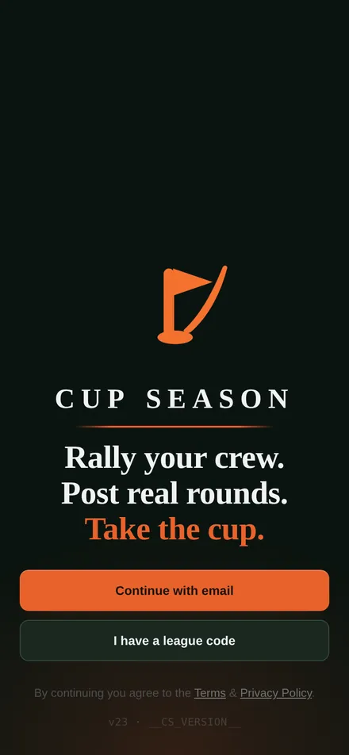
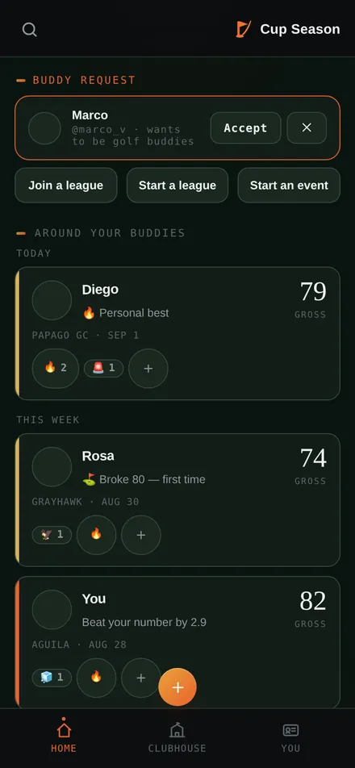
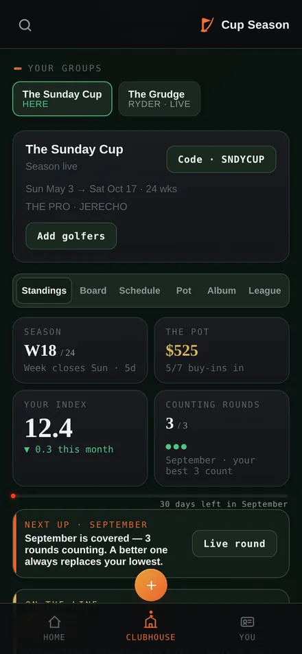
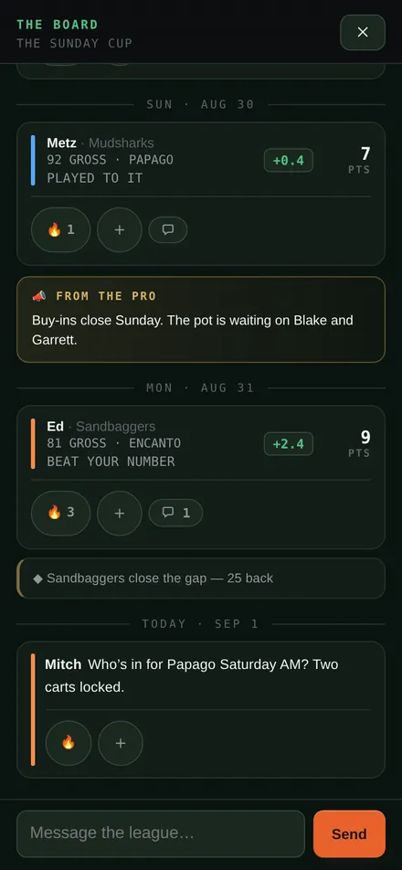
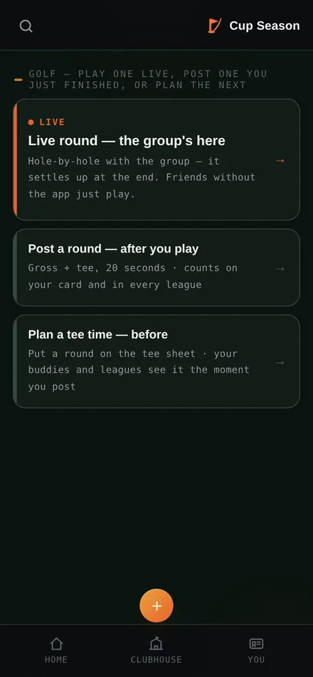
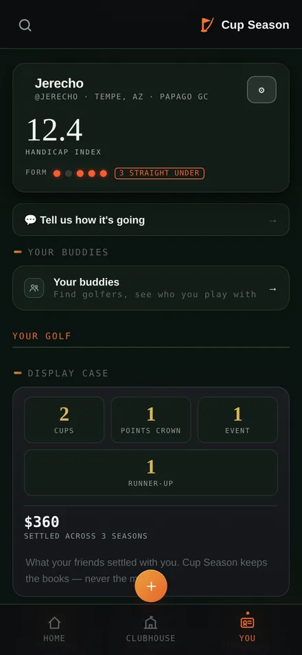
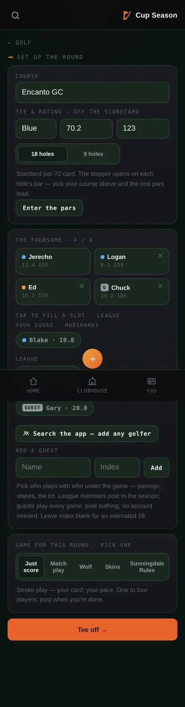
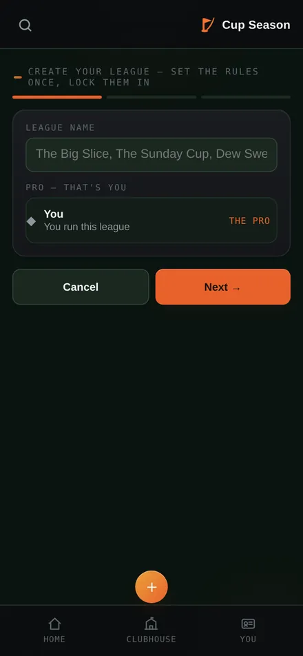
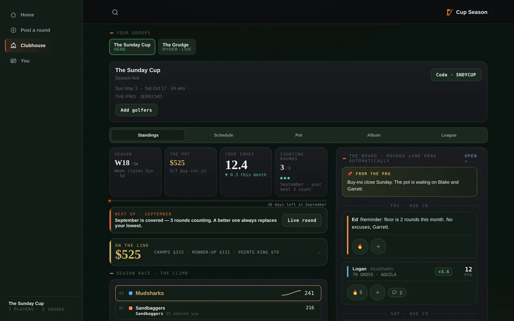
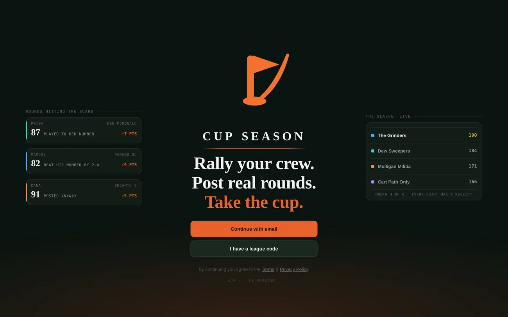

# Blind audit — 2026-09-01

Whole-product audit at repo HEAD `959b61a` (D185), run blind: screenshots first, spec second. Nine dimensions in parallel; every high/medium finding adversarially re-verified against the code before it could stand (53 surviving findings, 28 confirmed). Screenshots in `spec/audit-2026-09-01/` (local build, iPhone viewport; Google Fonts was blocked in the rig, so letterforms are fallbacks — judge layout, not type).

**Overall: 7 / 10 — played to it; a solid, launchable v1.**

> Cup Season's game, security, and App Store homework run at funded-team standard, but the product is dramatically stronger than its front door — a stranger's first ninety seconds are unsold, unmeasured, and one CDN fetch away from silently dead.

## The three verdicts

**Try it?** Split — decided entirely by the arrival path. Split verdict, decided entirely by the arrival path. A golfer who arrives on an invite or claim link says yes: the league code validates before the email round-trip, the buy-in covenant appears before joining, and a claim recipient is greeted with their own round waiting to be kept — best-in-class for this category. A cold stranger on a phone mostly says "maybe later": the mobile door is a logo, three lines, and an email demand (the repo's own D117 testers went 8-for-8 unable to define the product from it), and the measured funnel shows only 4 of 23 signups ever reached a league containing another human, so the solo trier lands in an empty room. Deciding factors: whether a friend brought them, whether the door ever shows the product before asking for the email, and whether esm.sh resolves — when it does not, every button silently does nothing and no one ever learns it happened.

**Recommend it after two weeks?** Yes inside a league; no outside one. Yes for the golfer inside a real league; no for anyone outside one. The retention machinery is the product's best dimension — named bands instead of jargon, the counting cap shown as live machinery, tappable receipts, auto-bye forgiveness, and a covenant ("you can't hurt your squad by playing badly — only by not playing") built to keep the high-handicapper posting — and the settlement/recap artifacts are engineered to carry the recommendation into the group chat. Two week-two hazards cut against it: a skeptical Pro who hand-checks a receipt gets a different number than the engine because the 95% allowance is invisible (the project's own D174 principle concedes that Pro will not keep the league), and a 10-to-17-hole walk-off silently scores nothing while the finish sheet claims "skipped, not lost" — a shared server flaw that already ate the owner's own round. The solo signup has nothing to retain and churns silently, and until this week the funnel could not even see it happening.

**App Store?** Close — a short owner checklist, not engineering. Not literally submittable today, but what stands between is a short owner checklist, not engineering. Apple-approval risk is low and unusually well-managed: native SwiftUI moots 4.2, Sign in with Apple covers 4.8, in-app account deletion covers 5.1.1(v), the privacy manifest is honest, the reviewer password door plus seeded league plus numbered walkthrough defuses the classic 2.1 email-OTP rejection, and D183's free-no-IAP posture deletes a review surface outright. Two genuine approval risks remain: the word "bet" ships twice on the exact Pot screen the review notes direct Apple to (a four-string fix across both clients, already ruled wrong by D131), and the concentrated 5.3.4 judgment call — one reviewer accepting the ledger-not-custody framing of a $450 pot; the pre-emption is disciplined and the appeal pre-written, so treat it as a possible one-bounce, not a wall. Owner-gated steps are the real gate: the reviewer password placeholder, App Store Connect state, and the live AASA check are all unverifiable from the repo. Ship D182 before pressing the button — not an Apple blocker, but the likeliest one-star generator. Store-presence quality trails approval readiness: 6 utility screenshots instead of the planned 8-shot narrative (a settings screen holding a slot the settlement card should own) and thin store-linked legal pages for a money-ledgering product.

## Scorecard

| Dimension | Score | Note |
|---|---|---|
| First-run & onboarding | 6.5 | Earned at both ends: the invited-friend path is best-in-class while the cold stranger meets an unselling door, a solo dead-end (4 of 23 ever reached another human), and a boot that can die silently. |
| Visual design & brand | 7.5 | A distinctive, disciplined identity — earned gold, ember action voice, store-ready icon family — whose confirmed blemishes are all low-severity polish; five surfaces went uncaptured, so the grade covers what was seen. |
| Native iOS app | 7.5 | Moved down half a point: 43k lines, 363 tests, and real submission prep merit the praise, but a confirmed unfixed data-loss path in the flagship feature plus exactly one push-registered device of field exposure is not yet an 8 in a user's hands. |
| App Store compliance | 8 | Professional-grade homework — reviewer account, honest privacy manifest, 5.3.4 pre-emption, free-no-IAP posture; what remains is four copy strings, thin legal pages, and owner-gated portal steps. |
| Web / PWA engineering | 7 | Best-in-class preflight and deploy discipline dragged down by one architectural bet: an unpinned, never-cached CDN import as the app's only external dependency and single point of failure. |
| Game legibility | 8 | The most coherent dimension — receipts, band language, an honest wizard that sells only what is built; the one crack, allowance invisibility, strikes the product's own thesis and is cheap to close. |
| Trust & security | 8 | Layered, self-enforcing discipline rare even in funded teams (machine-verified anon surface, fail-closed RPCs, zero secrets in tree); residual risk is supply-chain and an unflipped CSP, not data exposure. |
| Stranger funnel | 6.5 | The artifact pipe — per-token OG previews, claim landings — is genuinely well-built, but the loop the whole plan bets on has never produced a measured conversion, and one funnel node still cannot record by construction. |
| Accessibility & copy | 7 | Far above indie baseline — engineered reduced-motion, humanError(), real aria structure — with three systemic WCAG failures (contrast, focus, selected-state) all fixable in a day. |

## What the stranger sees

*The door — the whole pitch is a mark, three lines, and an email ask.*

*Home — buddy feed with reaction chips.*

*Clubhouse — week, pot, index, counting rounds; every number tappable.*

*The Board — rounds land as stories; Pro announcements in-line; chat beneath.*

*The ⊕ triptych — live, post-after, plan-ahead.*

*You — index, form, display case, settled-money line.*

*Tee sheet — foursome, guests, five game modes.*

*Wizard step 1.*

*Desktop clubhouse — the strongest single surface in the product.*

*Desktop door — the wings sell; the phone door does not use them.*

*The share card a settlement link unfurls as.*

## Confirmed findings

### High (4)

- **Entire first-run path hard-depends on esm.sh at runtime; failure is a silent dead door** · *First-run & onboarding*
  Every door handler — Continue with email, Verify, join-by-code, boot itself — lives inside the one module script whose first line imports supabase-js from esm.sh. If that CDN fetch fails (filtered network, flaky cell, CDN outage), the whole module never executes: buttons do nothing, the boot watchdog never arms (it is module-side), and the errbar is debug-gated off, so the user sees a beautiful splash with dead buttons and zero feedback. The sandbox reproduced this exactly: taps on all three door CTAs produced no UI change. The service worker deliberately never caches cross-origin, so even an installed PWA re-fetches esm.sh on every cold load. Vendoring supabase-js into the dist allowlist removes the risk entirely.
  — `index.html:14479 (import from esm.sh inside the module holding handlers at 17063/17272 and boot at 19811); sw.js:34 (cross-origin hands-off); index.html:3908-3915 (errbar off unless CS_DEBUG); shots 03-door-email.png / 04-door-joincode.png / 05-door-democode-result.png identical to 02-door-settled.png; rig-report.json`

- **The flagship live round can silently discard a real round, and it already has** · *Native iOS app*
  finish_live_round accepts only 18 complete holes or a clean front nine with nothing after; a 10–17 hole walk-off posts nothing while the finish sheet claims "a partial card is skipped, not lost." The owner himself lost a real 10-hole, 46-stroke round at Raven Silver (prod row a5429048), and the nine-hole escape is dead anyway because the guard demands a nine_rating the tee table never has. D182 is logged with an owner-approved shape but NOT built — first strangers will hit the cruelest data-loss path in the app's marquee feature.
  — `spec/decision-log.md D182 (2026-08-31, "NOT built"); docs/ios/PHASE-3-WAVE-8-PARITY.md §6.5`

- **Entire data layer hangs off an unpinned esm.sh import with no fallback and no failure signal** · *Web / PWA engineering*
  The one module script begins with `import { createClient } from 'https://esm.sh/@supabase/supabase-js@2'`; if that fetch fails, the whole module dies, and every interactive handler on the sign-in door (Continue with email, league code, all of boot) lives inside that module — the user sees a perfect-looking door whose buttons do nothing. The service worker explicitly never intercepts cross-origin (sw.js:34), so the library is never cached even for returning users, and the 8s boot watchdog that would report the stall is itself inside the dead module. Confirmed empirically: the rig blocked esm.sh and all signed-in flows became unreachable with only console-level errors. Vendoring supabase-js into the dist allowlist (or a local fallback copy) would remove the app's only external single point of failure.
  — `index.html:14479; sw.js:34; rig-report.json requestsFailed ('https://esm.sh/@supabase/supabase-js@2 :: net::ERR_TUNNEL_CONNECTION_FAILED'); door handlers at index.html:17063-17186 inside the module block`

- **The growth funnel recorded nothing for the entire pilot — fixed yesterday, so the core bet is still unmeasured** · *Stranger funnel*
  growthEvent() bailed on state.demo, which starts true and clears only after boot consumes ?join=/?claim=, so profile_created and link_opened logged zero rows across thirty signups while swallowing their own errors. D185 (2026-08-31, the day before this audit) deleted the guard, with exactly one proven prod row. The Year-1 plan bets everything on this loop's conversion rate ('make-or-break assumption'); as of today there is no data behind it, and 'unverified live' applies to whether the fix is even deployed.
  — `git 959b61a commit message; index.html:6826-6842; spec/claim-loop-instrumentation.md:9-14`

### Medium (19)

- **A code-less stranger's path dead-ends in an empty solo app — and the product knows it** · *First-run & onboarding*
  The code's own comment records the measured funnel: 20 of 23 golfers finished a card, only 4 ever reached a league with another human, six sit alone in leagues they made. The D151 crew step is the mitigation, but its effectiveness is unmeasurable because the growth funnel logged nothing until yesterday (see next finding). For a season-long social game, the first meaningful moment for a stranger with no league code is a league-less Home in an empty social graph — the exact moment they decide whether to recommend it.
  — `index.html:2849-2854 (D151 comment with the 4-of-23 figure), 14713-14755 (crew step)`

- **Onboarding funnel recorded zero events for its entire life; fix is one day old and unverified live** · *First-run & onboarding*
  growthEvent() bailed on state.demo, which starts true and clears only after the card save and after boot consumes ?join=/?claim= — so profile_created and link_opened never logged once across thirty signups, and the function swallows its own errors. Every onboarding decision to date was made blind. D185 deleted the guard and proved one event against prod, but the fix shipped 2026-08-31 and the live deploy is unverified from this sandbox.
  — `git 959b61a (D185 commit message + growthEvent diff); index.html:6825-6840`

- **The mobile door sells nothing before demanding an email** · *First-run & onboarding*
  The 'wings' that preview the product — a live-looking round feed and a season table — render only at min-width:1100px, and the demo diorama entry was permanently retired (D83). On a phone, the primary device, a stranger gets a logo, a three-line tagline, and two buttons; there is no screenshot, no how-it-works, no below-the-fold content. The desktop door (shot 20) proves the selling material exists; mobile just never shows it.
  — `index.html:1917-1918 (.ob-wing display:none, min-width:1100px), 17223-17228 (D83 demo retired); shots 01/02 (mobile, copy only) vs 20-desktop-door.png (wings visible)`

- **Near-zero field validation: the app's reliability story is untested at scale** · *Native iOS app*
  As of 2026-08-31 prod held exactly one push-registered device, the solo live-round default path crashed until the pre-TestFlight sweep found it (D178: "a solo TestFlight tester would have hit it on their first tap"), and the push sender was permanently unregistering testers on a routing mistake until D181. The engineering is strong but the decision log shows serious defects still surfacing daily from first real contact — the gap between "builds and 363 tests pass" and "strangers can rely on it" has barely started closing.
  — `spec/decision-log.md D178, D181 ("one push-registered device in all of prod")`

- **The word "bet" appears in-app on the pot screen the review notes point Apple to** · *App Store compliance*
  The pride-stakes surface ships "No stakes on the books. The cookout isn't going to bet itself." and a placeholder "The Lawn Bet" — in both the web client and the iOS PotPane. The banned-word rule (bet/wager/gambling) was scoped to store and press surfaces, but the review notes explicitly direct the reviewer to Clubhouse → Pot, where this copy lives. A reviewer primed on 5.3.4 who sees "bet" beside a $450 money ledger gets exactly the wrong impression; the fix is two strings.
  — `apps/ios/CupSeason/League/PotPane.swift:134,191; index.html:12490,12522; contrast docs/ios/app-store-listing.md posture rule`

- **Legal documents are thin for a product that ledgers real money** · *App Store compliance*
  The privacy policy is ~15 sentences with no data-retention terms, no children/age clause (despite a 4+ rating), and no GDPR/CCPA rights language; the Terms are six sentences with no liability limitation, no arbitration/governing law, and no minimum age. Apple only requires a privacy policy URL (satisfied), so this is not a review blocker, but a stranger — or a state regulator reading "prize pool" — would find less substance than the product's money surface warrants. The legal contact is jerecho@fischbeck3.com, a personal domain unrelated to cupseason.app, which reads off-brand in a store-linked policy.
  — `legal.html:48-84; legal/terms-of-service.md; legal/privacy-policy.md`

- **Offline PWA opens to a dead app with no offline messaging** · *Web / PWA engineering*
  The SW correctly serves the cached shell offline, but the shell then tries the esm.sh import, fails, and renders the same inert door — an installed home-screen app that opens and silently does nothing in a parking garage or on airplane wifi. There is no navigator.onLine check, no offline banner, and no degraded read-only mode anywhere in the client; a grep for offline/onLine handling finds only comments. For a product whose core moment is posting a round from a golf course (patchy cell coverage by nature), this is the exact bad-network embarrassment scenario.
  — `sw.js:36-51 (shell fallback works); index.html — no navigator.onLine / offline event listener exists (grep verified)`

- **supabase-js version floats — client behavior is not reproducible across deploys or users** · *Web / PWA engineering*
  The import pins only the major ('@2'), so esm.sh resolves whatever the latest 2.x is at each user's fetch time; two users on the same stamped build can run different library versions, and an upstream minor release can change auth/realtime behavior under a frozen client with no deploy. Given how much of this codebase's history is fighting subtle supabase-js behaviors (auth locks, realtime transport, INITIAL_SESSION timing), an exact-version pin is cheap insurance.
  — `index.html:14479 ('https://esm.sh/@supabase/supabase-js@2')`

- **CSP has sat in Report-Only with no report collector, so the enforcement flip criterion can never be met from real traffic** · *Web / PWA engineering*
  The policy ships as Content-Security-Policy-Report-Only with no report-uri/report-to, meaning violations are only visible in the console of whoever happens to have devtools open — the stated plan ('watch the console for a day; if clean, enforce') samples exactly one browser. The policy is also permanently weakened by the architecture: 'unsafe-inline' script-src is required forever by the inline script blocks, so even enforced it will not stop inline injection; the real value is connect-src exfiltration lockdown, which is still not enforced. Unverified live whether it has since been flipped.
  — `netlify.toml:23-30`

- **The real receipt omits the allowance step — its arithmetic doesn't reconcile by hand** · *Game legibility*
  roundCardBody shows 'Your number that day: 12.4' then 'Against your number: +1.5', but the engine computed that at 95% allowance — a Pro checking by hand (12.4 − 10.3 = 2.1) gets a different figure and possibly a different band, with no visible reason. Spec §16 explicitly requires the receipt to show the 'rating/slope/allowance snapshot', and the demo diorama's receipt DOES render an 'Index × allowance' row — the real one never does. This is the exact failure mode D174 warned about: 'a Pro who cannot reproduce a points figure by hand will not keep the league.'
  — `index.html:12848-12894 (no allowance row) vs index.html:13300 (demo shows it); spec/spec-v1.0.md §16 (line 264); spec/decision-log.md:4876`

- **The 95% allowance is invisible in every explanation of the game** · *Game legibility*
  The covenant, the scoring-help sheet, and the round cards all say rounds are 'scored against your own number', but under the default Standard preset the number actually played to is 95% of the index, disclosed only in the bylaws table row. A golfer who knows their index will find the app's 'vs your number' figure consistently ~0.6-1.5 lower than their own math and has no in-flow way to learn why. One sentence in the scoring sheet ('Standard leagues play you at 95% of your index — a small edge to the better player') would close it.
  — `index.html:19157-19174 (no allowance mention); spec/decision-log.md:4312 (D144: 'HANDICAP ALLOWANCE 95% stays in the table only')`

- **Fallback PvI paths still compute at 100%, resurrecting the D174 bug on skew** · *Game legibility*
  openRoundReceipt and enrichRoundReceipt fall back to `index_at_post - differential` with no allowance when the row carries no pvi (index.html:12903, 12934), and the server's round_card does the same for rounds without a rank row (round_card.sql:134). The instant view can therefore flash a different signed figure and band name than the enriched view a second later, and if the RPC fails (the documented deploy-skew case) the wrong figure stays. D174 fixed the composer; these fallbacks were not swept.
  — `index.html:12903, 12934; supabase/migrations/20260729180000_round_card.sql:134`

- **Entire data layer hard-depends on esm.sh at runtime, unpinned** · *Trust & security*
  The single module script imports supabase-js from https://esm.sh/@supabase/supabase-js@2 — floating on major version, no SRI, no vendored fallback. This sandbox demonstrated the outage half: with esm.sh blocked, sign-in and every real-data path were unreachable. The compromise half is worse: whatever esm.sh serves executes with full access to the user's session token, and the CSP that would constrain exfiltration is report-only. Vendoring a pinned build into the allowlist would close both.
  — `index.html:14479; netlify.toml Content-Security-Policy-Report-Only`

- **CSP has never been flipped from Report-Only to enforcing** · *Trust & security*
  netlify.toml ships Content-Security-Policy-Report-Only with an in-file promise to enforce 'after a day of clean console' — that flip has not landed (live state unverified from this sandbox, but the repo is the deploy source). Until enforced, the locked connect-src/img-src stops nothing; combined with 'unsafe-inline' script-src (forced by the single-file architecture), an injected script today faces no network-layer containment.
  — `netlify.toml:26-32`

- **claim_started can never be recorded — the funnel's middle column is structurally zero** · *Stranger funnel*
  The client fires claim_started only from the signed-out door branch (inside if(!CS.user && claimTok)), but log_growth_event drops every anon call whose node is not link_opened. So the RPC silently returns, the v_growth_funnel claim_started column stays zero forever, and nothing complains — the same silent-swallow failure mode D185 just diagnosed, surviving one node deeper. The artifact_shared→opened→profile funnel cannot show where claim recipients stall.
  — `index.html:19857/19868 vs supabase/migrations/20260828160000_growth_events.sql:110-112`

- **The stranger click-through hangs on an unpinned third-party CDN and degrades silently** · *Stranger funnel*
  The entire data layer imports supabase-js from https://esm.sh/@supabase/supabase-js@2 — unpinned major, no vendored fallback, and the SW caches same-origin only. If esm.sh is unreachable (corporate networks, DNS filters, CDN outage — exactly what this sandbox reproduced), the module never executes: a /?share= recipient gets the generic marketing door with no card and no error, a claim recipient never sees their round, and nothing is logged. The repo's own history ('a missing bridge fails silently as demo mode') names this failure family.
  — `index.html:14479; scratchpad/shots/rig-report.json (esm.sh ERR_TUNNEL_CONNECTION_FAILED → door renders, no card); sw.js:54-62`

- **--dim text tier fails WCAG contrast in both themes (~2.9:1) across 150+ uses** · *Accessibility & copy*
  Dark --dim #5C646B computes 2.87:1 on cards and 2.55:1 on raised surfaces; light --dim #8C9992 is 2.88:1 on paper. It is the color of every section eyebrow, stat label, climb rank/gap, chart note and caption — 156 color:var(--dim) declarations, almost all at 10-11.5px mono where AA requires 4.5:1. Visible in shots as the faint TODAY/THIS WEEK and AROUND YOUR BUDDIES labels. Older or outdoor-in-sunlight users — the actual golf demographic — will struggle with the app's entire wayfinding layer.
  — `index.html:51 (--dim:#5C646B), 92, 198-201 (.eyebrow), 156 grep hits; shots 10-demo-home.png, 13-demo-you.png; computed ratios`

- **Sheets and board declare aria-modal but never move or trap focus** · *Accessibility & copy*
  openSheet() adds .open and scrolls, but focus stays on the trigger behind the dialog; there is no focus trap, no inert on the background, and no focus restoration on close (grep finds zero trap code). With aria-modal=true, screen readers treat outside content as hidden while keyboard focus sits in it — a VoiceOver user opening any settlement, receipt or settings sheet is stranded. Escape and backdrop close do work, which softens but does not fix it. #boardFull has the same gap.
  — `index.html:13163-13191 (openSheet/closeSheet), 3983 (aria-modal), 5890-5897 (openBoardFull); no inert/trapFocus matches in file`

- **Selected state is visual-only on the tab bar and every segmented control** · *Accessibility & copy*
  The bottom nav toggles an .active class whose only signal is a 4px dot; no aria-current is ever set (zero matches file-wide). All .seg controls (clubhouse rooms Standings/Board/Schedule/Pot/Album/League, wizard team/draft/finish/pay segs, post-mode) carry selection as an .on class with no aria-pressed or tablist semantics. A screen-reader user hears six identical buttons and cannot tell which room they are in.
  — `index.html:3889-3894, 530-535, 3624, 3517-3541; grep aria-current returns nothing; shot 11-demo-clubhouse.png`

### Low (5)

- **The centered FAB occludes card actions and copy mid-scroll** · *Visual design & brand*

- **The stranger's first-run is thinner on the phone than on the web** · *Native iOS app*

- **The pot ledger remains the single concentrated App Review risk** **[App Review]** · *Native iOS app*

- **Error surfacing is disabled by default, so boot failures are invisible to users** · *Web / PWA engineering*

- **Signed-out telemetry is blind exactly where strangers fail** · *Stranger funnel*

## The ten fixes, ranked

1. **Ship D182 — post the walk-off round instead of silently discarding it** — The flagship live round scores nothing for a 10-17-hole card while the finish sheet on BOTH clients says 'skipped, not lost' — a shared server flaw that already ate the owner's own 10-hole round, with the fix shape owner-approved and unbuilt.
2. **Vendor a pinned supabase-js into the dist allowlist and SW shell** — One unpinned esm.sh fetch is the whole app's silent kill switch — door, boot, share and claim landings all render dead with zero error, zero telemetry, and no cache to fall back on, and it doubles as the app's only supply-chain exposure.
3. **Make the 95% allowance visible: receipt row, one scoring-sheet sentence, sweep the 100% fallbacks** — The product's thesis is show-your-work, yet a Pro hand-checking the real receipt gets a different figure (crossing a points band in 4 of 11 real rounds) while the demo diorama already renders the exact 'Index x allowance' row the real receipt omits.
4. **Put one screen of product on the mobile door before the email ask** — 8 of 8 testers could not define the product from the door, and on the primary device a stranger gets a logo, three lines and two buttons — the fix is already specced as D117 and the desktop wings prove the selling material exists.
5. **Finish the funnel: allow anon claim_started server-side, fix qaEvent's demo guard, re-prove profile_created live** — The Year-1 make-or-break loop has never produced a measurable conversion rate — the funnel's middle node still cannot record by construction, and the crew-step breadcrumbs are still swallowed on the exact cold-signup path D185 fixed for growthEvent alone.
6. **Change the two 'bet' strings on the Pot surface in both clients per D131** — The review notes walk Apple straight to the one screen where a banned word sits beside a $450 money ledger; D131 already ruled the copy wrong and the fix is four strings across index.html and PotPane.swift.
7. **Flip the CSP from Report-Only to enforcing** — The connect-src exfiltration lockdown — the policy's real value given forced unsafe-inline — has protected nothing for six weeks while the repo's own audit documents a concrete stored-XSS chain and separately concludes the flip is safe today.
8. **One-day accessibility floor: compliant --dim token, aria-current/aria-pressed on tabs and segs, focus trap in sheets** — Three confirmed WCAG failures sit on the app's entire wayfinding and modal layer for golf's actual demographic — older eyes, outdoor sun — and each fix is mechanical with a compliant token (--mut) and the aria pattern already present in the file.
9. **Give a dead boot a voice: onerror on the module script plus an offline banner** — An installed PWA opened at a golf course with patchy signal renders a perfect-looking door whose buttons silently do nothing — the one failure class that today produces no handled signal to the user or to telemetry.
10. **Thicken the store-linked legal pages and unify the contact address** — A six-sentence ToS with no age minimum, retention, or governing-law terms — contactable at an unrelated personal domain — is the thinnest surface a regulator or careful parent reading 'prize pool' will meet, and the repo's own listing doc already flags it.

## Method & blind spots

Nine dimension auditors read repo, spec, decision log and 20+ fresh Playwright screenshots; adversarial verifiers attacked every high/medium finding; a synthesis judge with repo access set final scores. Could NOT see from the sandbox: the live site and prod database (network policy) — "unverified live" applies to deploy state, the D185 funnel fix in prod, and Apple-portal state; the Pot/Album/League segments, Ryder scoreboard and door modals went uncaptured; signed-in real-account flows were not driven (the demo diorama stood in). The rig's blocked esm.sh is what *demonstrated* the dead-door failure live: with the module unloaded, every door CTA silently no-ops.

Full illustrated report (private artifact): https://claude.ai/code/artifact/e5a6f0b6-cf0c-40f6-9326-ce4f71532d73
